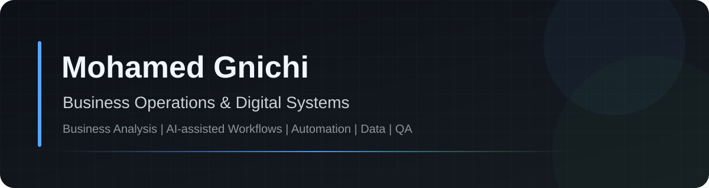

  

  
  
  
  
  
  

## Profile

I am a **Business Operations & Digital Systems** professional focused on translating real business needs into structured workflows, internal tools, dashboards, validation rules, reporting systems, and AI-assisted automation.

My approach combines **business analysis, process improvement, data, QA, and practical software delivery** — with an emphasis on systems that remain understandable, testable, secure, and useful in day-to-day operations.

> Production and company repositories are intentionally private. Public material is sanitized to protect confidential source code, credentials, customer information, and internal data.
## Professional Experience

### Aluminium Space · Business Operations & Digital Systems
**October 2024 — Present · Tunisia**

- Translate operational needs into structured digital workflows and internal tools
- Coordinate information across finance, suppliers, HR, projects, and management
- Improve document, approval, reporting, and follow-up processes
- Build and validate business applications with React, TypeScript, Supabase, and AI-assisted workflows
- Test critical flows, document systems, and support iterative deployment

## Core Capabilities

| Area | Focus |
|---|---|
| **Business Analysis** | Requirements, process mapping, workflow design, validation rules |
| **Digital Systems** | Internal tools, dashboards, portals, operational applications |
| **Automation** | Documents, approvals, repetitive-process reduction |
| **AI-assisted Workflows** | Extraction, classification, contextual assistance, decision support |
| **Data & Reporting** | KPIs, data validation, operational reporting, dashboards |
| **QA & Delivery** | Testing, debugging, documentation, deployment, iteration |
## Public Portfolio

These repositories present my work without exposing private production code.

| Repository | What it demonstrates |
|---|---|
| [Aluminium Space Showcase](https://github.com/mohamedgnichi/aluminium-space-showcase) | Customer journeys, quotations, operational workflows, dashboards, multilingual UX |
| [Finance Automation Case Study](https://github.com/mohamedgnichi/finance-automation-case-study) | Finance workflows, documents, validation, reporting, auditability |
| [ASAGI Operations Case Study](https://github.com/mohamedgnichi/asagi-operations-case-study) | Projects, tasks, approvals, structured follow-up, AI-assisted operations |
| [Energy Monitoring Case Study](https://github.com/mohamedgnichi/energy-monitoring-case-study) | Data validation, analytics, reporting, secure external integrations |
| [Business Analysis Toolkit](https://github.com/mohamedgnichi/business-analysis-toolkit) | Requirements, user stories, acceptance criteria, decision logs, test scenarios |
| [Process Mapping Playbook](https://github.com/mohamedgnichi/process-mapping-playbook) | AS-IS / TO-BE mapping, RACI, KPIs, risk & control templates |

**Portfolio website:** [mohamedgnichi.github.io](https://mohamedgnichi.github.io)
## Selected Private Systems

### Aluminium Space Digital Platform
Customer and operations platform covering product discovery, quotation workflows, customer interactions, operational dashboards, multilingual UX, PDF generation, and AI-assisted features.

### Finance & Accounting Automation
Internal system for document intake, validation, fiscal workflows, payroll, reporting, audit trails, and AI-assisted extraction.

### ASAGI — Executive Operations Workspace
Internal workspace for projects, tasks, approvals, structured follow-up, business operations, and AI-assisted support.

### Energy & Operations Monitoring
Private analytical dashboard for energy and water monitoring, validation, reporting, comparisons, and secure server-side integrations.

## Technology

**Application:** React · TypeScript · JavaScript · Vite · Tailwind CSS  
**Backend & Data:** Supabase · PostgreSQL · REST APIs  
**Quality:** Vitest · Playwright · ESLint · TypeScript checks  
**Delivery:** Git · GitHub · GitHub Actions · Vercel · PWA workflows  
**Business:** Process analysis · requirements · finance operations · supplier follow-up · project coordination · QHSE
## Selected Verified Certifications

I maintain **56 documented certificates and attestations** across AI, business, data, finance, leadership, and sustainability.

- [AI For Everyone](https://coursera.org/verify/2GQC8MEY2BC7) — DeepLearning.AI
- [Generative AI: Fundamentals, Applications, and Challenges](https://coursera.org/verify/K5QAQESTBT7Q) — University of Michigan
- [Prompt Engineering for ChatGPT](https://coursera.org/verify/EMR2HPZY5E5T) — Vanderbilt University
- [Introduction to Digital Transformation](https://coursera.org/verify/UUHBE6VT5DRP) — Siemens
- [Business Metrics for Data-Driven Companies](https://coursera.org/verify/CAI7HVQE794F) — Duke University
- [Auditing I: Conceptual Foundations of Auditing](https://coursera.org/verify/UZO3NX9GEHH7) — University of Illinois Urbana-Champaign
- [ESG Essentials for Sustainable Business](https://coursera.org/verify/8E7G4FRB3XRP) — Duke University
- [Principles of Sustainable Finance](https://coursera.org/verify/K0D9UN9FOIAM) — Erasmus University Rotterdam
- [High Performance Collaboration: Leadership, Teamwork, and Negotiation](https://coursera.org/verify/XNWJR8UYKRTT) — Northwestern University

## How I Work

- Start with the **business process**, not the interface
- Convert requirements into clear workflows, data rules, and usable systems
- Use AI to reduce repetitive work while keeping important decisions human-owned
- Validate critical flows with testing rather than visual checks alone
- Protect confidential data, credentials, and private source code
- Document systems so another person can understand and operate them
## Education & Continuous Development

- **Applied Bachelor's / Licence Appliquée in QHSE Management** — in progress, expected 2027
- **BTS in Information Systems Management** — 2025
- **Baccalaureate in Economics** — 2023
- **WorldQuant University Data Science Lab** — ongoing practical data work

## Current Direction

**Business Analysis · Business Systems · Digital Transformation · AI Operations · Data-informed Operations**

I am continuing to develop practical systems that connect business understanding with reliable technical execution in international and remote environments.

## Contact

**Mohamed Gnichi** · Tunisia  
[Portfolio](https://mohamedgnichi.github.io) · [LinkedIn](https://www.linkedin.com/in/mohamed-gnichi) · [Email](mailto:mohamedgnichi93@gmail.com)

---

  <strong>Business understanding first. Technology in service of the workflow.</strong>

